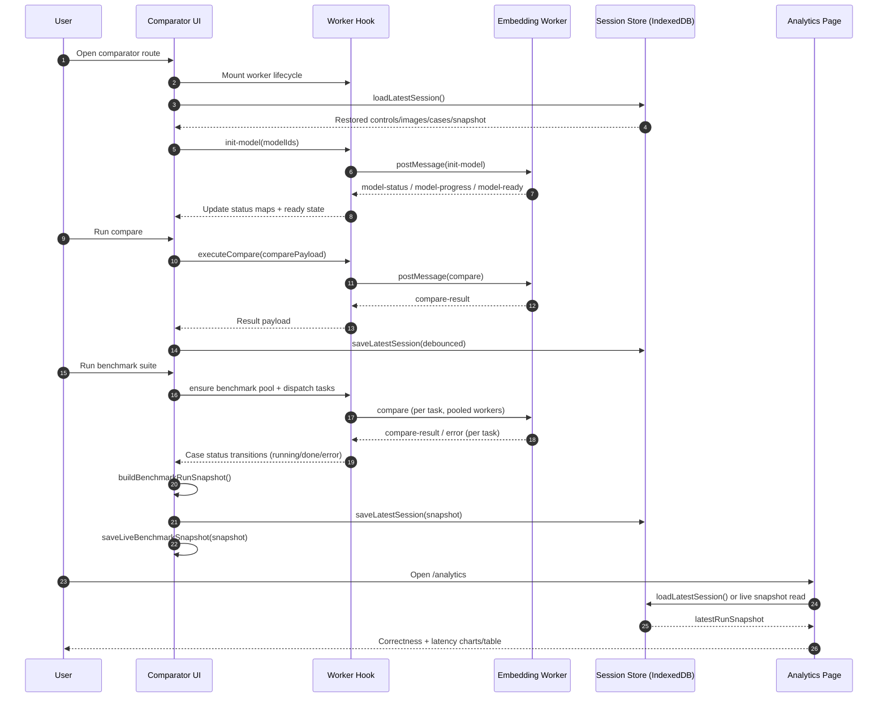

# Architecture

This document describes how the comparator works in production terms: module boundaries, runtime data flow, worker protocol, persistence model, and how to safely extend/debug the system.

## 1) System Overview

The app is a browser-local image comparison system with three major planes:

1. UI/Orchestration plane (React + Next.js client components)
2. Compute plane (Web Worker + Transformers.js + pixel math)
3. Persistence plane (IndexedDB session store + snapshot handoff for analytics)

Primary routes:
- `/app/page.tsx`: Comparator workflow (upload, select ROIs, compare, benchmark)
- `/app/analytics/page.tsx`: Post-run analytics (correctness + latency)

Design goals:
- Keep UI responsive during model initialization and inference
- Enforce strict payload/model validation before compute
- Persist user state and benchmark snapshots across refresh/navigation
- Preserve backward compatibility for older persisted sessions

## 2) Module Boundaries

### 2.1 Comparator (UI/orchestration)

Main orchestrator:
- `/components/comparator/comparator-app.tsx`

Core feature modules:
- `/components/comparator/use-comparator-worker.ts`
  - Owns worker lifecycle, message routing, compare promise bridge, runtime progress/status maps
- `/components/comparator/use-comparator-session.ts`
  - Composition layer for hydration + persistence hooks
- `/components/comparator/use-session-hydration.ts`
  - Reads/restores persisted session, images, controls, benchmark cases
- `/components/comparator/use-session-persistence.ts`
  - Debounced autosave + clear session handling
- `/components/comparator/use-benchmark-suite.ts`
  - Benchmark task orchestration with adaptive worker pool

UI sections:
- `/components/comparator/comparator-control-center.tsx`
- `/components/comparator/model-status-dialog.tsx`
- `/components/comparator/benchmark-summary-card.tsx`
- `/components/comparator/benchmark-cases-list.tsx`
- `/components/comparator/results-panel.tsx`
- `/components/comparator/image-upload-panel.tsx`

Local shared definitions:
- `/components/comparator/comparator-types.ts`
- `/components/comparator/comparator-formatters.ts`
- `/components/comparator/comparator-session-types.ts`
- `/components/comparator/session-serialization.ts`

### 2.2 Worker (compute)

Entrypoint:
- `/workers/embedding.worker.ts`

Worker feature modules:
- `/workers/embedding/messages.ts`: message dispatch + top-level error handling
- `/workers/embedding/validate.ts`: compare/model input validation
- `/workers/embedding/model-init.ts`: model loading pipeline + status emissions
- `/workers/embedding/progress.ts`: progress/status posting adapters
- `/workers/embedding/metadata.ts`: safe HF metadata fetch + size extraction
- `/workers/embedding/compare.ts`: model and pixel similarity execution + hybrid aggregation
- `/workers/embedding/vector.ts`: tensor/output -> embedding vector conversion
- `/workers/embedding/cache.ts`: in-memory runtime caches
- `/workers/embedding/runtime.ts`: worker runtime state and loaded model registry
- `/workers/embedding/constants.ts`: limits/timeouts/guard constants

### 2.3 Persistence

Compatibility entrypoint:
- `/lib/comparator/session-store.ts`

Implementation:
- `/lib/comparator/session-store/api.ts`
- `/lib/comparator/session-store/indexeddb.ts`
- `/lib/comparator/session-store/normalize-session.ts`
- `/lib/comparator/session-store/normalize-benchmark.ts`
- `/lib/comparator/session-store/normalize-benchmark-case.ts`
- `/lib/comparator/session-store/normalize-run-snapshot.ts`
- `/lib/comparator/session-store/normalize-compare-result.ts`
- `/lib/comparator/session-store/normalize-primitives.ts`
- `/lib/comparator/session-store/normalize-shared.ts`
- `/lib/comparator/session-store/types.ts`

## 3) Runtime Sequences (How It Works)

### 3.1 Startup and Hydration

1. Comparator route mounts.
2. Worker is created (`use-comparator-worker`).
3. Session is loaded (`use-session-hydration`) from IndexedDB.
4. Restored state includes:
   - source/target images + bboxes
   - controls (threshold/weights/size/quick mode)
   - selected models/preset
   - benchmark cases
   - `latestRunSnapshot`
5. After hydration + worker mount, model init starts with restored/default model IDs.

### 3.2 Model Initialization and Status

1. UI sends `init-model` with model IDs.
2. Worker validates IDs and selection count.
3. For each model, worker emits:
   - phase: `metadata-loading`
   - optional metadata size fetch (timeout guarded)
   - phase: `initializing`
   - progress events during model asset download/init
   - final phase: `ready` or `error`
4. UI merges `model-status` and `model-progress` maps.
5. Size non-regression behavior: if a newer event has unknown size, previously known size is retained.

### 3.3 Single Compare

1. User selects source and target regions.
2. UI validates min ROI dimensions.
3. UI crops + resizes ROIs and sends typed RGBA payload to worker.
4. Worker validates payload shape and bounds.
5. Worker computes:
   - model similarity (if embedding weight > 0)
   - pixel similarity (if pixel weight > 0)
   - hybrid score = weighted combination
6. Worker responds with `compare-result`.
7. UI updates `ResultsPanel`.

### 3.4 Benchmark Suite

1. Cases are created from current source/target pair payloads.
2. `use-benchmark-suite` creates benchmark tasks.
3. Adaptive worker pool runs tasks concurrently.
4. Case statuses transition: `idle -> running -> done|error`.
5. On completion, run snapshot is generated with run-time threshold/weights/model IDs.
6. Snapshot is persisted and mirrored for analytics route.

## 4) Worker Message Protocol

Request messages:
- `init-model`
- `compare`
- `clear-cache`

Response messages:
- `model-status`
- `model-progress`
- `model-ready`
- `compare-result`
- `cache-cleared`
- `error`

Contract notes:
- Compare requests use typed RGBA arrays, not data URLs
- Worker errors are reported as safe user-facing strings
- Message handlers reject malformed payloads early

## 5) Security and Safety Controls

Input validation hardening includes:
- Model ID validation and normalization
- Model selection count cap enforcement
- Compare payload validation:
  - integer dimensions
  - dimension bounds
  - RGBA length consistency
- Metadata fetch safety:
  - fixed endpoint pattern
  - timeout with abort
  - non-blocking fallback to unknown size

Operational safety:
- UI never runs model inference directly
- Worker boundary isolates heavy compute and untrusted payload parsing

## 6) Persistence Model

Persisted session stores:
- image blobs + bboxes
- controls and selected model configuration
- benchmark cases (including expected outcome)
- selected benchmark case id
- latest benchmark run snapshot

Normalization strategy:
- Load path normalizes all persisted structures
- Missing/new fields get defaults for backward compatibility
- Invalid records are sanitized/rejected safely

## 7) Caching Model

Worker runtime cache (tab-local, memory only):
- per-image-pair pixel cache
- per-model embedding cache

Benchmark pooling:
- benchmark workers can be reused between runs for same runtime/model setup

User controls:
- `Clear runtime cache` resets compute caches
- `Clear saved session` removes IndexedDB session state

## 8) Analytics Data Source

Analytics route should read run snapshot data, not recompute from transient UI-only state.

Snapshot semantics:
- Uses threshold/weights/model IDs captured at benchmark run time
- Enables stable correctness/latency reporting after navigation/refresh

## 9) Model Catalog and Presets

Model catalog lives in `/lib/comparator/model-config.ts`. Each entry has an ID (Hugging Face model path), display label, and notes. The catalog drives the Thorough preset and the model selector UI.

Preset definitions live in `/components/comparator/comparator-types.ts`:

| Preset       | Models                                | Compare Size | Quick Mode |
| ------------ | ------------------------------------- | ------------ | ---------- |
| Fast         | DINOv2 Small                          | 160 px       | On         |
| Balanced     | SigLIP Base Patch16 + DINOv2 Small    | 224 px       | Off        |
| Thorough     | All catalog models                    | 320 px       | Off        |

Fast uses DINOv2 for its structure-focused matching at lower cost. Balanced pairs it with SigLIP for semantic diversity. Thorough runs every catalog model for maximum coverage.

Default model IDs (used when no preset is active) are configured in `MODEL_CONFIG.defaultModelIds`.

## 10) Extension Guide

Safe extension points:
- Add new model presets in comparator types/config
- Add new worker metrics in `compare.ts` and extend response types
- Add new charts on analytics page from snapshot fields

Rules to preserve:
- Keep worker protocol typed and backward compatible
- Keep session normalization strict (never trust raw persisted data)
- Preserve non-blocking model init behavior if metadata fails

## 11) Verification Runbook

Recommended checks after architecture-impacting changes:

1. `pnpm lint`
2. `pnpm build`
3. Manual smoke:
   - upload source/target and compare
   - initialize multiple models and inspect status dialog
   - add benchmark cases and run suite
   - open `/analytics` and verify chart/table population
   - refresh and confirm restored session/snapshot behavior

## 12) Sequence Diagram

